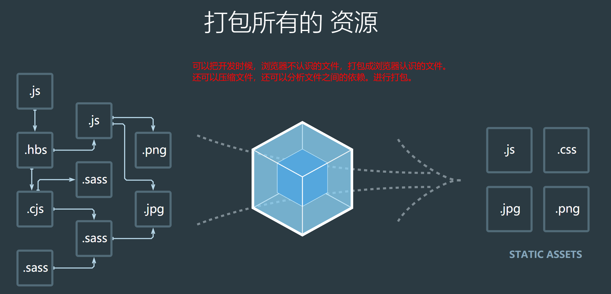
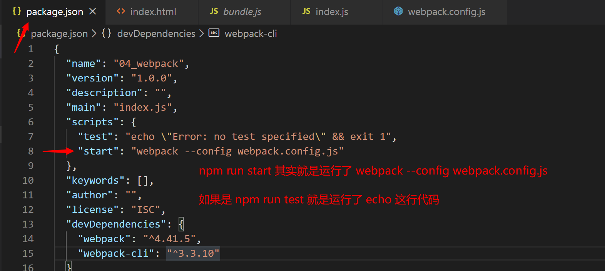
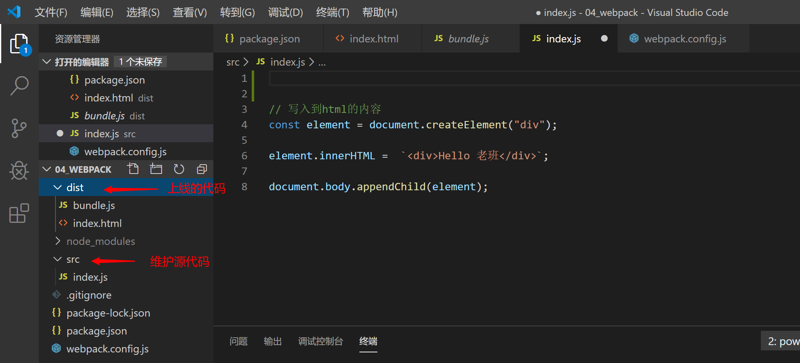
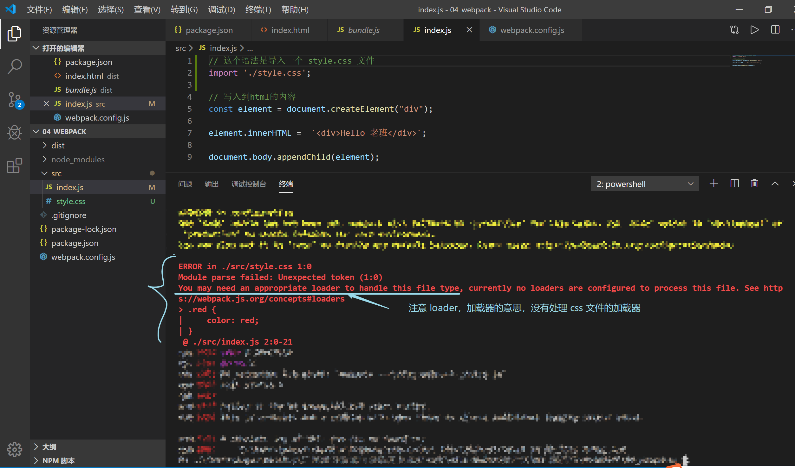

# webpack教程

## 为什么要使用 webpack

加工资 + 


### 概念

webpack 是一个模块打包器。webpack 的主要目标是将 JavaScript 文件打包在一起。



### Nodejs

需要提前安装。


```
npm install 包名称 --save-dev  

devDependencies  开发环境需要的依赖包。真正发布的时候是不需要的。
```


```
npm install 包名称

会自动记录在 dependencies 位置，发布项目的时候，也需要依赖的包。
```

注意：webpack 只是一个中间用于处理文件的工具，所以这个工具的包基本都是 --save-dev 方式下载。


## 安装 webpack

新建在项目文件夹`webpack-demo`，并且初始化项目

```
npm init -y
```


安装 webpack 依赖   

```
npm install --save-dev webpack webpack-cli
```


添加启动选项

`package.json`

```js
"scripts": {
    "start": "webpack --config webpack.config.js"
}
```

`webpack.config.js`是默认配置文件，也就是说`--config webpack.config.js`选项可以忽略，那么接下来需要在根目录中新增该文件。


> 注意：
>
> `webpack` 不推荐全局安装 !!!!!!!，不方便管理。


## 起步

一个简单的使用案例


### 基本内容

准备项目文件结构如下：

> **注意：** 注释前面带了加号（+）的表示要新增的文件。

```js
- webpack-demo
	- dist					// + 输出目录，在浏览器中运行的目录
		- index.html		// + 浏览器页面入口文件
	- node_modules
	- src					// + 开发目录
    	- index.js			// + 项目入口文件 
    - package.json			// 项目配置文件
    - webpack.config.js		// + webpack配置文件
```


`dist/index.html`

```html
<!DOCTYPE html>
<html lang="en">
<head>
    <meta charset="UTF-8">
    <meta name="viewport" content="width=device-width, initial-scale=1.0">
    <meta http-equiv="X-UA-Compatible" content="ie=edge">
    <title>webpack demo</title>
</head>
<body>
    <script src="../src/index.js"></script>
</body>
</html>
```


`src/index.js`

```js
// 写入到html的内容
var element = document.createElement("div");
element.innerHTML =  `<div>hello webpack</div>`;

document.body.appendChild(element);
```


OK!，项目代码准备就绪了，在浏览器打开`dist/index.html`可以查看效果，但是这里有两个问题：

1.为什么要把html代码写在 js 里面？直接写在html多简单。

nodejs只认识 js 文件，可以使用其他模板或者框架方法来简化，比如vue，react。


2.webpack呢？webpack在哪？

webpack会根据配置文件的内容要对项目进行构建打包，不用去关心具体的操作，只看结果。


### 开始打包

`webpack.config.js` 文件中，粘贴以下代码

```js
const path = require('path');

module.exports = {
    entry: './src/index.js',					// 项目入口
    output: {
        filename: 'bundle.js',                  // 默认打包后的文件名 bundle.js
        path: path.resolve(__dirname, 'dist')   // 默认打包后的文件目录 dist
    }
};
```


**常见的错误：**

1.webpack配置的入口文件entry

该配置可以使用相对路径，如果要使用相对路径的话前面必须要加上`./`，不能直接用文件夹的名字。


2.webpack配置的输出目录

output.path选项的路径必须是绝对路径，可以用`path.resolve`方法获取到绝对路径。


`dist/index.html`

> **注意：**src 的是开发目录，会通过 webpack 把 src 目录的中资源打包到 dist 中，所以以后 index.html 和 src 目录再无瓜葛，引用的资源都来自于打包后的 dist。

```html
<!DOCTYPE html>
<html lang="en">
<head>
    <meta charset="UTF-8">
    <meta name="viewport" content="width=device-width, initial-scale=1.0">
    <meta http-equiv="X-UA-Compatible" content="ie=edge">
    <title>webpack demo</title>
</head>
<body>
    <!-- <script src="./src/index.js"></script> -->
    <script src="./bundle.js"></script>
</body>
</html>
```


开始打包，在命令行中输入以下命令：

> 注意切换到项目目录下

```
npm run start
```


输出结果：

```
> webpack-demo@1.0.0 start C:\Users\40777\Desktop\webpack
> webpack --config webpack.config.js

Hash: e184fa0a8a3d55b577bc
Version: webpack 4.39.2
Time: 456ms
Built at: 2019-08-26 17:03:18
    Asset      Size  Chunks             Chunk Names
bundle.js  1.04 KiB       0  [emitted]  main
Entrypoint main = bundle.js
[0] ./src/index.js 196 bytes {0} [built]

WARNING in configuration(配置警告)
The 'mode' option has not been set. Set 'mode' option to 'development' or 'production' to enable defaults for this environment.('mode' 选项还未设置。将 'mode' 选项设置为 'development' 或 'production'，来启用环境默认值。)
```


> **注意：**上述输入即是打包成功，配置的警告不影响打包结果，可忽略。


dist 目录结构:

```js
- webpack-demo
	- dist					// 输出目录，在浏览器中运行的目录
		- index.html		// 浏览器页面入口文件
		- bundle.js			// + 打包后的文件
	- // 其他文件
```





### 总结

上面是一个基本的构建过程，当然除了构建js文件外，还可以对图片，样式，字体文件等资源进行管理，`切记这是一个nodejs环境的项目`。




## 模块加载器

模块加载器是webpack用于加载并处理其他`非js文件`的文件，比如自定义模板文件，css，图片，字体等资源文件。

> 注意：
>
> nodejs 环境下默认只认识 js 文件。


### 加载 css

新增css文件

```js
- webpack-demo
	- src
    	- index.js			
		- style.css	// + 新增css文件
    - // 其他文件
```


`src/style.css`

```css
.red {
    color: red;
}
```


`src/index.js`

```js
import './style.css';

// 写入到html的内容
var element = document.createElement("div");
element.innerHTML =  `<div class="red">hello webpack</div>`;
document.body.appendChild(element);
```



`webpack.config.js`

```js
const path = require('path');

module.exports = {
    entry: './src/index.js',
    output: {
      filename: 'bundle.js',                            
      path: path.resolve(__dirname, 'dist')    
    },
	
    // 模块加载器配置项
    module: {
        rules: [
            {
                test: /\.css$/,			// 匹配css扩展名文件
                use:[					// 配置loader加载器
                    'style-loader',		// 把css代码写入到网页中
                    'css-loader'		// 读取css的代码
                ]	
            }
        ]
    }
};
```


上面引用了两个加载器`style-loader`和`css-loader`，需要下载依赖包

```
npm install --save-dev style-loader css-loader
```

再次执行打包

```
npm run start
```


> 再次打开`dist/index.html`就能看能到红色的文字了。


### 加载 less

新增less文件

```js
- webpack-demo
	- src
    	- index.js			
		- style.css	
		- style.less // + 新增less文件
    - // 其他文件
```


`src/style.less`

```less
.blue {
    color: blue;
}
```


`src/index.js`

```js
import './style.css';
// 导入less文件
import './style.less'


// 写入到html的内容
var element = document.createElement("div");
element.innerHTML =  `
    <div class="red">hello webpack</div>
    <div class="blue">hello webpack and less</div>
`;
document.body.appendChild(element);
```


`webpack.config.js`

```js
const path = require('path');

module.exports = {
    // 其他配置...
	
    // 模块加载器配置项
    module: {
        rules: [
            // 其他配置...
            {
                test: /\.less$/,		// 匹配less扩展名文件
                use:[				
                    'style-loader',		// 把less代码写入到网页中
                    'css-loader',		// 读取less的代码
                    'less-loader'		// 解释编译less代码
                ]	
            },
        ]
    }
};
```


安装依赖包

```
npm install --save-dev less less-loader
```


执行打包

```
npm run start
```


### 提取 css

通过`dist`文件结构我们发现打包出的文件中并没有独立的css文件，那么css样式被打包到哪里去了呢？

如果用编辑器打开bundle.js文件会发现内容有`document.createElement("style")`字样，其实css被打包到bundle.js中了。

那么假如 css 的内容很多，`会让 bundle.js 文件变得很大，加载变慢，性能和体验都很差`，所以我们需要把 css 的内容单独拆分到一个样式文件中，使用 [webpack插件ExtractTextWebpackPlugin](https://www.webpackjs.com/plugins/extract-text-webpack-plugin/)

`webpack.config.js`

```js
const path = require("path");

//  导入提取样式的webpack插件
const ExtractTextPlugin = require("extract-text-webpack-plugin");

module.exports = {
    // 其他配置...

    // 模块加载器配置项
    module: {
        rules: [
            // {
            //     test: /\.css$/,			// 匹配css扩展名文件
            //     use:[					// 配置loader加载器
            //         'style-loader',		// 把css代码写入到网页中
            //         'css-loader'		// 读取css的代码
            //     ]
            // },
            {
                test: /\.css$/,
                use: ExtractTextPlugin.extract({	// 提取css
                    fallback: "style-loader",
                    use: ["css-loader"]
                  })
            },
            // {
            //     test: /\.less$/,		// 匹配less扩展名文件
            //     use:[
            //         'style-loader',		// 把less代码写入到网页中
            //         'css-loader',		// 读取less的代码
            //         'less-loader'		// 解释编译less代码
            //     ]
            // },
            {
                test: /\.less$/,
                use: ExtractTextPlugin.extract({	// 提取less
                    fallback: "style-loader",
                    use: ["css-loader", "less-loader"]
                  })
            },
            
            // 其他配置...
        ]
    },

    plugins: [
        new ExtractTextPlugin('style/style.css') // 提取到dist的style文件夹中
    ]
};
```


安装依赖包

```
npm install extract-text-webpack-plugin@next --save-dev
```

> **注意：**@next是下载最新版本


执行打包

```
npm run start
```


最新`dist`目录结构

```js
- webpack-demo
	- dist
		- style
			- style.css // 打包后的css文件
		- // 其他文件
```


需要把打包后的样式导入的`index.html`中

`dist/index.html`

```html
<!DOCTYPE html>
<html lang="en">
<head>
    <meta charset="UTF-8">
    <meta name="viewport" content="width=device-width, initial-scale=1.0">
    <meta http-equiv="X-UA-Compatible" content="ie=edge">
    <title>webpack demo</title>
    <!-- + 导入样式 -->
    <link rel="stylesheet" href="./style/style.css">
</head>
<body>
    <script src="./bundle.js"></script>
</body>
</html>
```


### 加载图片

在 nodejs 环境中所有的文件都是一个模块，需要导入才能使用，图片也不例外，比如我们想要在项目中引入一张图片。

```js
- webpack-demo
    - images
    	- logo.jpg
	- // 其他文件
```


`src/index.js`

```js
import './style.css';
import './style.less'

// 导入图片
import logo from "../images/logo.jpg"

var element = document.createElement("div");

// 添加显示图片
element.innerHTML =  `
	<div class="red">hello webpack</div>
	<div class="blue">hello webpack and less</div>

	
`;

document.body.appendChild(element);
```


> **注意：**能被src调用说明`import的logo是一个链接`。


`webpack.config.js`

```js
// 其他代码

module.exports = {
    // 其他配置...
	
    // 模块加载器配置项
    module: {
        rules: [
            // 其他配置...
			{
                test: /\.(png|svg|jpg|gif)$/,	// 匹配图片文件
                use: [
                    {
                        loader: "file-loader",              // 处理图片文件返回链接
                        options: {
                            publicPath: "./images/",   		//  引入图片时会在路径前面加上该选项
                            outputPath: "images"            //  输出到dist下的images目录
                        }
                    } 
                ]
            }
        ]
    }
};
```


> **注意：**处理图片时的配置稍微复杂点了，主要是`file-loader`需要搭配一些选项来使用，这些选项可以自行修改，[参考文档。](https://www.webpackjs.com/loaders/file-loader/)


安装依赖包

```
npm install --save-dev file-loader
```


执行打包命令

```
npm run start
```


最新`dist`目录结构

```js
- webpack-demo
	- dist
		- images
			- [hash字符串组成].jpg
		- // 其他文件
		- bundle.js
```


## 管理输出

### 自动生成html

目前我们都是在 index.html 中手动引入打包后的资源，这种引入方式有很多缺点，比如文件名依赖问题，`假如 webpack 配置中的输出文件名修改了，需要及时在 index.html 中同步修改，`再者每次新增文件都要引入一遍很繁琐。


可以使用 [HtmlWebpackPlugin插件](https://www.webpackjs.com/guides/output-management/#%E8%AE%BE%E5%AE%9A-htmlwebpackplugin) 自动引入打包后的资源文件到html文件，该插件需要指定一个html模板文件，并且会生成一个 index.html 文件到 dist 目录中。

既然都要自动生成了，那么 dist 下 index.html 就没必要存在了，删除 `dist/index.html`，并且新建html模板文件.


**新增 public 目录存放公共资源：**

```js
- webpack-demo
	- // 其他文件
    - public
		- index.html
```


`public/index.html`

```html
<!DOCTYPE html>
<html lang="en">
<head>
    <meta charset="UTF-8">
    <meta name="viewport" content="width=device-width, initial-scale=1.0">
    <meta http-equiv="X-UA-Compatible" content="ie=edge">
    <title>webpack demo</title>
</head>
<body>
</body>
</html>
```


安装依赖包

```
npm install --save-dev html-webpack-plugin
```


`webpack.config.js`

```js
// 其他引入
const HtmlWebpackPlugin = require("html-webpack-plugin");

module.exports = {
   	// 其他配置
    
    plugins: [
        new ExtractTextPlugin("style/style2.css"),
        // + 新增配置
        new HtmlWebpackPlugin({
            template: "public/index.html"	// template指定默认html模板
        })
    ]
};
```


执行打包

```
npm run start
```


此时打开`dist/index.html`会发现已经自动引入了资源了。


### 清除dist

使用 [clean-webpack-plugin插件](https://www.webpackjs.com/guides/output-management/#%E6%B8%85%E7%90%86-dist-%E6%96%87%E4%BB%B6%E5%A4%B9) 在每次打包前清除下dist文件夹。

安装依赖包

```
npm install --save-dev clean-webpack-plugin 
```


`webpack.config.js`

```js
// 其他代码

// 导入清除插件
const { CleanWebpackPlugin } = require('clean-webpack-plugin');

module.exports = {
    // 其他配置

    plugins: [
        new ExtractTextPlugin("style/style.css"),
		
        // 调用清除打包目录插件
        new CleanWebpackPlugin(),
        
        new HtmlWebpackPlugin({
            template: "public/index.html"
        }),
    ]
};

```


## 开发环境

开发环境一般指的是我们在`本地开发`时候使用的场景，这种场景下代码可以快速追踪错误，不压缩文件，而且由于在本地开发，所以可以加载体积大一点文件。


### 错误追踪

我们先来做一个错误追踪的测试，新建一个`error.js`。

`src/error.js`

```js
const error = function(){
    var a = 123;
    a.push(456);
}

export default error;
```

> **注意：** 上面的代码运行会报错，a没有push方法。


`src/index.js`

```js
import './style.css';
import './style.less'
import logo from "../images/logo.jpg"

// + 导入错误的模块
import error from "./error"

// 执行会报错的函数
error();

// 其他
```


执行打包命令

```
npm run start
```


刷新`dist/index.html`，可以看到以下的错误信息。

```
Uncaught TypeError: 123.push is not a function										bundle.js:1 
    at bundle.js:1
    at Module.<anonymous> (bundle.js:1)
    at t (bundle.js:1)
    at bundle.js:1
    at bundle.js:1
```


上面我们写了一个错误的函数，但是浏览器的在报错的时候提示的`错误文件是bundle.js`，这当然是正常的，因为这是我们最后打包出来的文件，但是我们可以通过[webpack的source map](https://www.webpackjs.com/guides/development/#使用-source-map)准确地知道错误来自于哪个源文件。


`webpack.config.js`

```js
// 其他代码

module.exports = {
    // 其他配置

    devtool: "source-map", // + 生成映射源代码文件

    // 模块加载器配置项
    module: {
        // 其他代码
    },
    
    // 其他配置 
```


> **注意：** 上面的 [devtool:"source-map" 配置](https://www.webpackjs.com/configuration/devtool/#devtool)会在`dist`目录中生成一个`bundle.js.map`文件，该文件主要的作用是把打包后的`bundle.js`映射到源文件上，这样就可以准确的追踪报错的源代码的位置了。
>
> `bundle.js.map`文件也会加载到页面中，并且文件体积很大，所以此模式只适用于开发环境。


再次执行打包命名，查看错误提示

```
Uncaught TypeError: 123.push is not a function										error.js:3 
    at error.js:3
    at Module.<anonymous> (index.js:9)
    at t (bootstrap:19)
    at bootstrap:83
    at bundle.js:1
```


此时错误就很精确了，`error.js` 第3行。


### 开发服务器 !!!!

目前我们修改一次代码，就要执行一遍`npm run start`打包，非常麻烦，webpack 提供了一个简单的开发服务器`webpack-dev-server`，该服务器能够帮助我们在本地开启一个开发服务器环境，并且能够监听文件的修改，每当编辑文件保存后浏览器会自动加载刷新页面。


安装依赖

```
npm install --save-dev webpack-dev-server
```


`webpack.config.js`

```js
// 其他代码

module.exports = {
    // 其他配置
    
    devtool: "source-map", 
	
    // + 开发服务配置
    devServer: {
         port: 8000 // 默认端口是8080
    },

    // 模块加载器配置项
    module: {
        // 其他配置
    }
    
    // 其他配置
}
```


> **注意：**可以通过文档查看 [devServer 服务器配置列表](https://www.webpackjs.com/configuration/dev-server/)


上面的配置devServer可以对开发服务器进行配置，**注意：devServer不读取项目中的dist目录，而是读取服务器内存中的文件，我们不需要知道具体的存放地址，只需要知道两者输出的内容是一样的。**可以删除项目下的 dist 文件夹进行验证。

下面来添加一个新的`scripts`命令，用于启动开发服务器。

`package.json`

```json
{
    // 其他配置
    
	"scripts": {
    	"start": "webpack --config webpack.config.js",
    	"dev": "webpack-dev-server --config webpack.config.js --open"
  	},
    
    // 其他配置
}
```

> **注意：** webpack-dev-server添加了两个配置选项：
>
> 1. `--config webpack.config.js`和webpack一样是默认配置文件，可以省略。
>
> 2. `--open`表示自动打开浏览器，该配置默认值是`false`。


打开开发服务器命令

```
npm run dev
```

> **注意：**启动后不要关闭命令行窗口，否则会关闭服务器，可以使用`ctrl+c`关闭服务器。


打开浏览器访问地址<http://localhost:8000/>，然后尝试修改`src`中任何一个文件保存，浏览器就自动刷新了。


## 生产环境

生产环境和开发环境刚好相反，开发环境在本地运行，而生产环境是要产出`运行在线上服务器面向用户使用的代码`，因此两者的构建目标差异很大，比如打包后的文件在生产环境中要尽可能的小，逻辑代码分离，优化静态资源（压缩图片），去除 `source map`文件等。

**因此开发环境和生产环境不能共用一份webpack配置文件，需要分别指定**

但是两个环境还是有很多配置可以共用的，比如entry、output、module等，因此可以把公共部分的配置抽离出来放到一个独立的文件然后进行合并，我们可以使用`webpack-merge`工具来进行合并。

> **注意：**entry、output、module这些配置在我们当前示例可以通用，但未必适合所有项目。

安装依赖

```
npm install --save-dev webpack-merge
```


开始拆分`webpack.config.js`文件，拆分后该文件可废弃。

新建`config`文件夹:

```js
- webpack-demo
	- config 				// 存放配置文件的文件夹
		- webpack.base.js	// 公共的配置
		- webpack.dev.js	// 开发环境的配置
		- webpack.pro.js	// 生成环境的配置

	- // 其他文件
```


### 配置文件

`config/webpack.base.js`

```js
const path = require("path");
const ExtractTextPlugin = require("extract-text-webpack-plugin");
const HtmlWebpackPlugin = require("html-webpack-plugin");
const { CleanWebpackPlugin } = require('clean-webpack-plugin');

module.exports = {
    // 入口
    entry: "./src/index.js",
    
    // 输出
    output: {
        filename: "bundle.js",
        path: path.resolve(__dirname, "../dist")  // 注意此处输出目录是父级文件夹
    },
    
    // 模块加载器
    module: {
        rules: [
            {
                test: /\.css$/,
                use: ExtractTextPlugin.extract({
                    fallback: "style-loader",
                    use: ["css-loader"]
                })
            },
            {
                test: /\.less$/,
                use: ExtractTextPlugin.extract({
                    fallback: "style-loader",
                    use: ["css-loader", "less-loader"]
                })
            },
            {
                test: /\.(png|svg|jpg|gif)$/,
                use: [
                    {
                        loader: "file-loader", 
                        options: {
                            publicPath: "./images/", 
                            outputPath: "images"
                        }
                    }
                ]
            }
        ]
    },

    plugins: [
        // 提取css样式到单独文件
        new ExtractTextPlugin("style/style2.css"),
		
        // 每次构建前清除dist目录
        new CleanWebpackPlugin(),
		
        // 自动生成index.html到dist
        new HtmlWebpackPlugin({
            template: "public/index.html"
        }),
    ]
}
```


`webpack.dev.js`

```js
const merge = require('webpack-merge');
const base = require('./webpack.base.js');

module.exports = merge(base, {
    mode: "development",
    
    // 生成map映射文件
    devtool: "source-map",
	
    // 开发服务器配置
    devServer: {
        port: 8000 // 默认端口是8080
   },
})
```


`webpack.pro.js`

```js
const merge = require('webpack-merge');
const base = require('./webpack.base.js');

module.exports = merge(base, {
    mode: "production"
})
```


> **注意：**拆分完`webpack.config.js`后可以把该文件删除了。


修改`scripts`启动命令，**删除 start 命令，增加 build 命令用于生产环境，注意指定配置文件的路径变化**

`package.json`

```json
{
    // 其他配置
    
    "scripts": {
        "dev": "webpack-dev-server --config config/webpack.dev.js --open",
    	"build": "webpack --config config/webpack.pro.js"
    }
    
    // 其他配置
}
```


OK！以后开发的话就使用`npm run dev`命令，需要打包上线就运行`npm run build`，把dist目录丢给运维的同事部署即可（当然现在的项目工程里都有自动化部署了）。


## 进阶


### 多入口和输出

多入口需要修改`entry`配置，理由很简单，**我们一个页面往往需要引入多个`js`文件。**在这之前我们都是把`src/index.js`打包成`dist/bundle.js `引入到项目中，那如果有多个`index.js`类型的文件呢？

为了演示方便，我们先清空下`src`文件夹，再添加新文件：

```js
- webpack-demo
	- src
		- index.js
		- about.js
```


> **注意：**index.js和about.js没有任何关系，都是独立的不相互引用。


`src/index.js`

```js
var element = document.createElement("span");
element.innerHTML =  `hello`;
document.body.appendChild(element);
```


`src/about.js`

```js
var element = document.createElement("div");
element.innerHTML =  `about`;
document.body.appendChild(element);
```


`config/webpack.base.js`

```js
// 其他代码

module.exports = {
    // 用对象的方式配置多个入口
    entry: {
        index: "./src/index.js",
        about: "./src/about.js"
    },
    output: {
        // 修改输出路径和文件名，[name]是动态的，读取entry的属性
        filename: "js/[name].bundle.js",			
        path: path.resolve(__dirname, "../dist")
    },
    
    // 其他代码
}
```


为了方便查看代码，我们执行`npm run build`命令，可以看到 dist 的结构如下

```js
- webpack-demo
	- dist
		- js
			- index.bundle.js
			- about.bundle.js
		- index.html
```


在浏览器中打开index.html可以看到同时引入两个 js 文件，使用开发服务器 `npm run dev` 打开效果一致。


### 提取公共模块

我们来做一个测试，把一个 [jquery.js](https://cdn.bootcss.com/jquery/3.4.1/jquery.min.js) 作为公共文件放到`src/utils`目录中。

```js
- webpack-demo
	- src
		- utils 		// + 公共的模块
			- jquery.js 	// + 测试用的公共文件
		- index.js
		- about.js
```

 

然后把`src/utils/jquery.js`分别引入到 index.js 和 about.js 中。

```js
import jquery from "./utils/jquery";

// 其他代码
```


执行构建命令

```
npm run build
```


查看打包后的 `about.bundle.js` 和 `index.bundle.js` 文件源码，会发现它们都把 jquery.js 打包进去了，这样做的后果不敢想象。所以我们需要使用 [CommonsChunkPlugin](https://www.webpackjs.com/plugins/commons-chunk-plugin) 插件把类似`公共的依赖模块`提取到一个单独的文件中。


`config/webpack.base.js`

```js
// 其他代码

module.exports = {
    
    // 其他代码
    
    // + 提取公共模块配置
    optimization: {
        // 分割的块
        splitChunks: {
            chunks: 'all'	// 提取所有文件的共同模块
        }
    },
    
    module: {
        // 其他代码
    },
    
    // 其他代码
}
```


再次执行打包

```
npm run build
```


可以看到当前项目的公共模块 jquery 的内容已经被打包到一个 独立的 `about~index.bundle.js`文件中了，当然这个文件名可以[通过配置](https://webpack.docschina.org/plugins/split-chunks-plugin/#splitchunks-name)修改的。


> **注意：**公共模块的大小必须大于 `30kb`才会被独立打包，jquery 的大小是 87kB。

> [另一种拆分bundles的方法 dll。]()


## 单页应用

### vue


